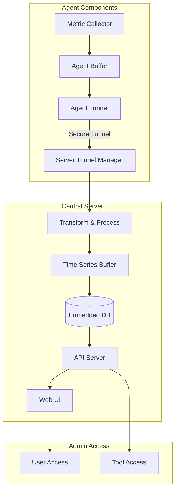
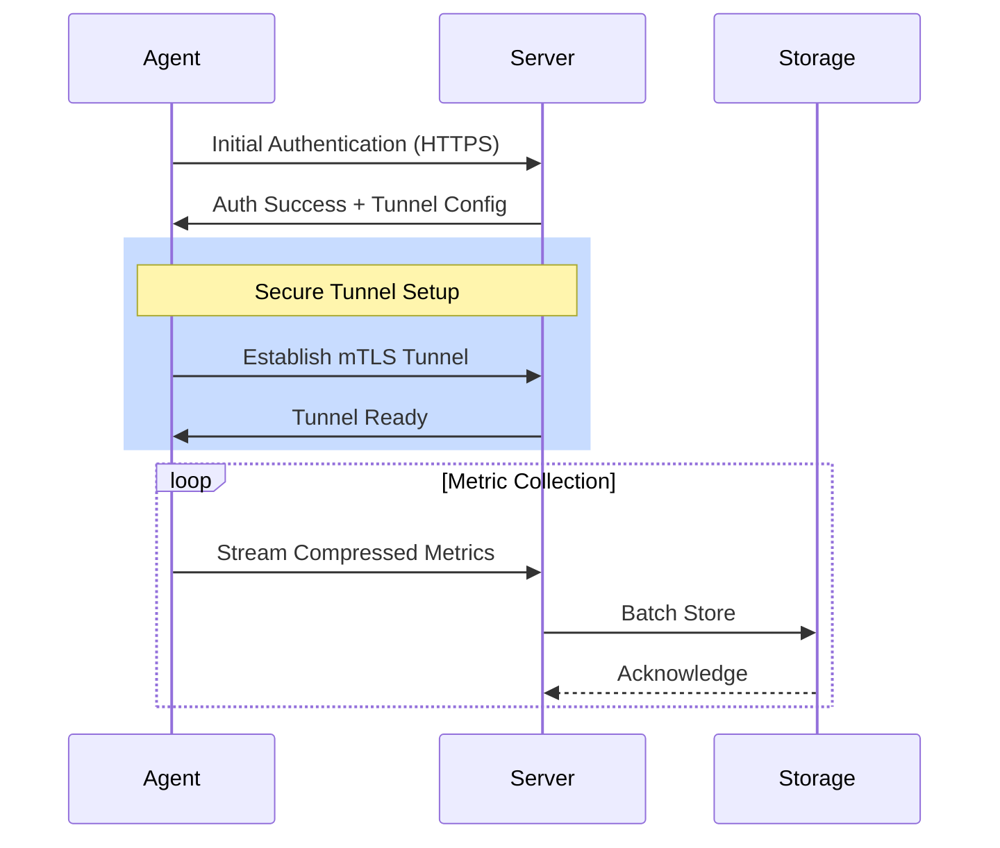
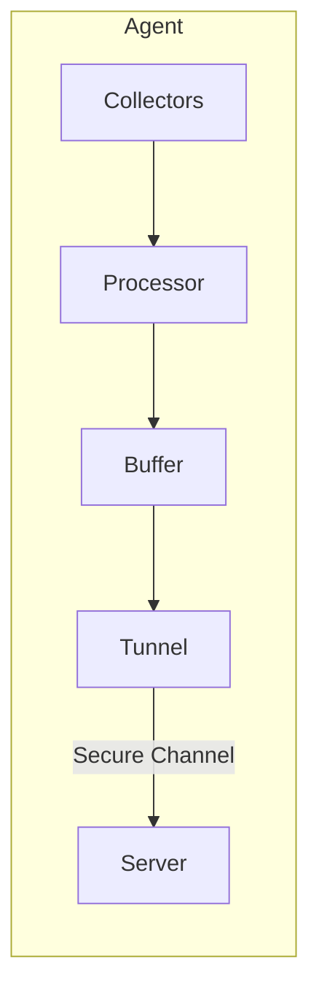
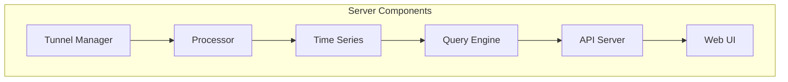
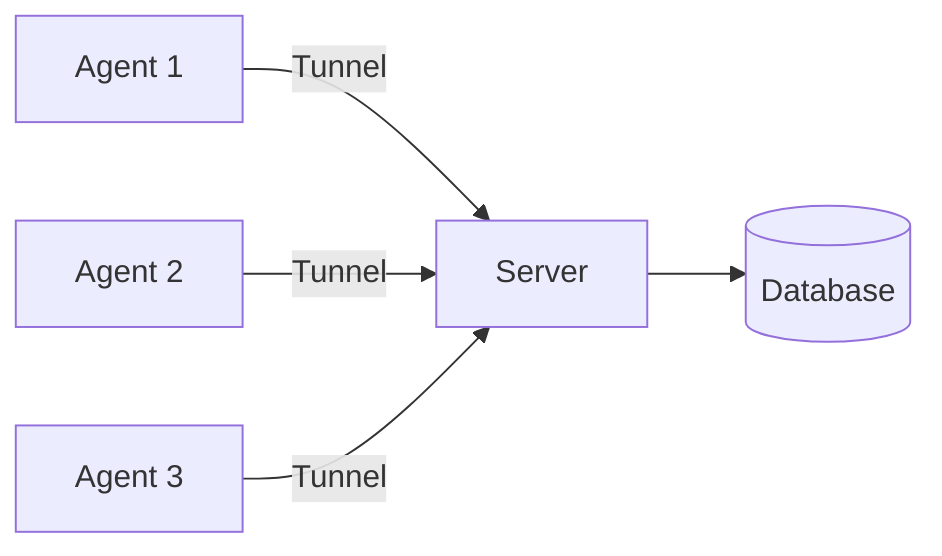
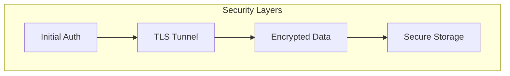

# LightWatch: Open Source Lightweight Infrastructure Monitoring

## Table of Content

- [Summary](#summary)
- [Problem Statement](#problem-statement)
- [System Architecture](#system-architecture)
- [Communication Flow](#communication-flow)
- [Agent Architecture](#agent-architecture)
- [Server Architecture](#server-architecture)
- [Deployment Options](#deployment-options)
  - [Single Server](#single-server)
- [Security Architecture](#security-architecture)

### Summary
LightWatch is an open source infrastructure monitoring platform designed to be lightweight, secure, and easy to deploy. It uses a tunnel-based communication approach between agents and the central server, ensuring efficient and secure data transmission while maintaining minimal resource overhead.

### Problem Statement
Current infrastructure monitoring solutions face several challenges:
1. High resource consumption and system overhead
2. Complex setup processes and configuration
3. Insecure or inefficient data transmission methods
4. Heavy dependencies on external services
5. Complex deployment architectures
6. Network security concerns in distributed environments

### System Architecture

### Communication Flow

#### Agent Architecture

#### Server Architecture

### Deployment Options

#### Single Server

### Security Architecture

